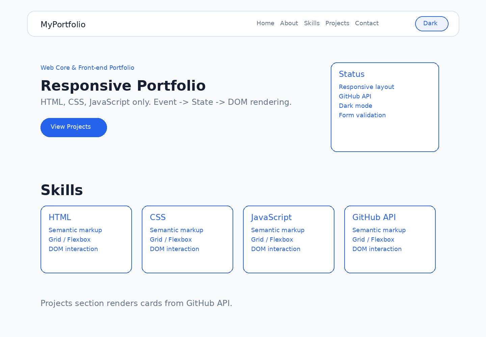
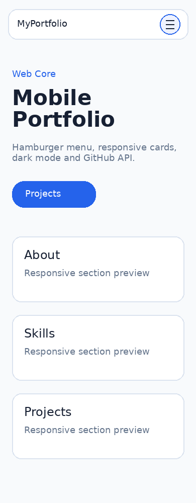
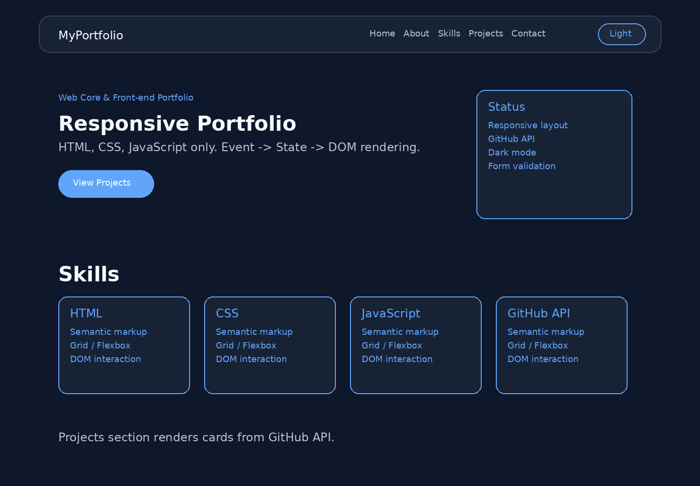

# 웹 기초 완성, 나만의 포트폴리오 구축

순수 HTML, CSS, JavaScript만으로 만든 반응형 포트폴리오 웹사이트입니다. 외부 UI 프레임워크 없이 시맨틱 마크업, 반응형 레이아웃, DOM 이벤트 처리, 상태 기반 렌더링, GitHub API 비동기 연동을 구현했습니다.

> 제출 전 `index.html`의 `body data-github-username="octocat"` 값을 본인 GitHub 아이디로 바꾸고, 아래 GitHub 저장소 URL과 배포 URL을 실제 주소로 수정하세요.

- GitHub 저장소 URL: `https://github.com/<본인아이디>/<저장소명>`
- 배포 URL: `https://<본인아이디>.github.io/<저장소명>/`

## 1. 과제 목표

이 프로젝트의 목표는 React 학습 전 필요한 웹 핵심 개념을 직접 구현해보는 것입니다.

- HTML 시맨틱 태그로 페이지 구조 설계
- CSS Flexbox, Grid, CSS 변수, 미디어 쿼리를 활용한 반응형 레이아웃 구현
- JavaScript의 `querySelector`, `addEventListener`, `classList`, `textContent`, `innerHTML`을 활용한 DOM 조작
- 사용자 이벤트 → 상태 변경 → DOM 렌더링 흐름 구현
- `fetch`, `async/await`, `try/catch`를 사용한 GitHub API 연동
- 로딩, 성공, 실패, 빈 데이터 상태 UI 표현

## 2. 주요 기능

### 필수 기능

- Header, Hero, About, Skills, Projects, Contact, Footer 섹션 구성
- 모바일, 태블릿, 데스크톱 반응형 레이아웃
- 모바일 햄버거 메뉴 토글
- 네비게이션 클릭 시 부드러운 섹션 이동
- 300px 이상 스크롤 시 맨 위로 이동 버튼 표시
- 60px 이상 스크롤 시 헤더 스타일 변경
- 다크 모드 토글 및 `localStorage` 저장
- Contact 폼 필수값 및 이메일 형식 검증
- GitHub API 저장소 목록 비동기 호출
- Projects 섹션의 로딩, 성공, 오류, 빈 상태 렌더링

### 선택 기능

- GitHub 저장소 언어별 필터링
- 시스템 다크 모드 감지(`prefers-color-scheme`)
- Intersection Observer 기반 스크롤 등장 애니메이션

## 3. 파일 구조

```text
portfolio_project/
  index.html
  css/
    style.css
  js/
    main.js
  images/
    profile.svg
  screenshots/
    desktop.png
    mobile.png
    dark.png
  README.md
```

## 4. 실행 방법

별도 빌드 도구나 패키지 설치가 필요 없습니다.

### VS Code Live Server 사용

1. VS Code에서 프로젝트 폴더를 엽니다.
2. Live Server 확장 프로그램을 설치합니다.
3. `index.html`을 우클릭하고 `Open with Live Server`를 선택합니다.
4. Chrome 브라우저에서 화면과 기능을 확인합니다.

### Python 간이 서버 사용

```bash
cd portfolio_project
python -m http.server 5500
```

브라우저에서 아래 주소로 접속합니다.

```text
http://localhost:5500
```

## 5. GitHub API 설정 방법

`index.html`의 `body` 태그에 있는 값을 본인 GitHub 아이디로 변경합니다.

```html
<body data-github-username="octocat">
```

예를 들어 GitHub 아이디가 `myname`이라면 다음처럼 수정합니다.

```html
<body data-github-username="myname">
```

JavaScript는 이 값을 읽어서 아래 엔드포인트로 저장소 목록을 요청합니다.

```text
https://api.github.com/users/<본인아이디>/repos?sort=updated&per_page=12
```

GitHub API는 인증 없이 호출하면 시간당 요청 횟수 제한이 있습니다. 403 응답이 발생하면 Projects 섹션에 오류 메시지와 다시 시도 버튼이 표시됩니다.

## 6. 내부 구조 설명

### HTML

`div`만으로 구조를 만들지 않고 다음 시맨틱 태그를 사용했습니다.

- `header`: 상단 로고, 네비게이션, 메뉴 버튼, 다크 모드 버튼
- `nav`: 섹션 이동 링크
- `main`: 핵심 콘텐츠 영역
- `section`: Hero, About, Skills, Projects, Contact 영역
- `article`: 기술 카드와 프로젝트 카드
- `footer`: 저작권과 소셜 링크

폼 요소는 `label`의 `for` 값과 입력 요소의 `id`를 연결해 접근성을 높였습니다.

### CSS

- `:root`에 색상, 간격, 그림자, 반지름 변수를 정의했습니다.
- `[data-theme="dark"]`에서 다크 모드 변수를 별도로 덮어씁니다.
- 네비게이션은 Flexbox로, 기술 카드와 프로젝트 카드는 Grid로 배치했습니다.
- 프로젝트 카드는 `repeat(auto-fit, minmax(240px, 1fr))`로 화면 너비에 따라 자동으로 줄바꿈됩니다.
- 768px 이상에서는 데스크톱 네비게이션을 표시하고, 1024px 이상에서는 여백과 레이아웃을 확장합니다.

### JavaScript

`main.js`는 다음 역할로 나누었습니다.

- 테마 상태 관리: `applyTheme`, `toggleTheme`
- 메뉴 상태 관리: `setMenuOpen`, `handleMenuToggle`
- 스크롤 UI: `handleScroll`, `scrollToTop`, `updateActiveNavLink`
- 등장 애니메이션: `observeSections`
- GitHub API: `fetchGitHubProjects`, `renderProjects`, `renderProjectStatus`, `renderFilters`
- 폼 UX: `validateField`, `handleFormInput`, `handleFormSubmit`

## 7. 핵심 자료구조와 문법

### 상태 객체

```js
const state = {
  theme: localStorage.getItem("portfolio-theme") || getSystemTheme(),
  menuOpen: false,
  navScrolled: false,
  projects: [],
  filteredLanguage: "all",
  projectStatus: "idle",
  projectError: "",
};
```

하나의 기능을 만들 때 이벤트가 직접 HTML을 마구 바꾸지 않도록, 먼저 `state` 값을 변경하고 그 상태를 기준으로 화면을 다시 렌더링했습니다.

### 배열 메서드

- `filter`: fork 저장소 제외, 선택된 언어 프로젝트만 표시
- `map`: GitHub API 데이터를 화면 렌더링용 객체와 HTML 카드로 변환
- `forEach`: 여러 링크와 섹션에 이벤트 또는 옵저버 연결

### 비동기 처리

```js
try {
  const response = await fetch(url);
  const repos = await response.json();
} catch (error) {
  setProjectStatus("error", error.message);
}
```

요청 전에는 로딩 상태, 성공하면 카드 목록, 실패하면 오류 메시지와 재시도 버튼을 보여줍니다.

## 8. 상태 변경 흐름

### 다크 모드

사용자 클릭 → `state.theme` 변경 → `document.documentElement`의 `data-theme` 변경 → CSS 변수 변경 → `localStorage` 저장

### GitHub 프로젝트

페이지 로드 → 로딩 상태 렌더링 → API 요청 → 성공/실패/빈 데이터 상태 변경 → Projects 섹션 렌더링

### 폼 입력

사용자 입력 또는 제출 → 필드 값 검사 → 오류 상태 표시/숨김 → 유효하면 성공 메시지 출력

### 프로젝트 필터

필터 버튼 클릭 → `state.filteredLanguage` 변경 → 선택 언어에 맞는 배열 필터링 → 카드 목록 재렌더링

## 9. 예외 처리 방식

- GitHub API 실패: 오류 메시지와 `다시 시도` 버튼 표시
- GitHub API 403: 레이트 리밋 안내 메시지 표시
- 저장소 없음: `표시할 프로젝트가 없습니다.` 메시지 표시
- Contact 폼 빈 값: 필수 입력 메시지 표시
- 이메일 형식 오류: 이메일 형식 안내 메시지 표시
- 모바일 메뉴 열린 상태에서 데스크톱 너비로 변경: 메뉴 상태 초기화

## 10. 테스트 시나리오

| 구분 | 테스트 내용 | 기대 결과 |
| --- | --- | --- |
| 반응형 | 375px, 768px, 1440px 화면 확인 | 모바일에서는 햄버거 메뉴, 넓은 화면에서는 가로 메뉴 표시 |
| 메뉴 | 모바일에서 햄버거 버튼 클릭 | 메뉴가 열리고 다시 클릭하면 닫힘 |
| 스크롤 | 300px 이상 스크롤 | 맨 위로 이동 버튼 표시 |
| 헤더 | 60px 이상 스크롤 | 헤더 배경과 그림자 변경 |
| 다크 모드 | 토글 버튼 클릭 후 새로고침 | 선택한 테마 유지 |
| API 성공 | 올바른 GitHub 아이디 설정 | 프로젝트 카드 표시 |
| API 실패 | 잘못된 GitHub 아이디 또는 네트워크 오류 | 오류 메시지와 다시 시도 버튼 표시 |
| 빈 폼 제출 | 입력 없이 제출 | 각 필드 오류 메시지 표시 |
| 이메일 오류 | `test` 입력 후 제출 | 이메일 형식 오류 표시 |
| 폼 성공 | 모든 값 정상 입력 | 성공 메시지 표시 |

## 11. 스크린샷

아래 이미지는 제출용 예시입니다. 실제 제출 전 본인 브라우저에서 데스크톱, 모바일, 다크 모드 화면을 다시 캡처해 교체하면 좋습니다.

### 데스크톱



### 모바일



### 다크 모드



## 12. 구현하면서 고려한 점

- React를 사용하지 않고도 상태와 렌더링의 흐름을 이해할 수 있게 `state` 객체를 명시했습니다.
- `onclick` 같은 인라인 이벤트 대신 `addEventListener`를 사용했습니다.
- `var` 대신 `const`와 `let`만 사용했습니다.
- 외부 UI 라이브러리를 사용하지 않고 CSS만으로 레이아웃과 인터랙션을 구성했습니다.
- GitHub API 오류 상황을 빈 화면으로 두지 않고 평가자가 확인할 수 있는 UI로 표현했습니다.

## 13. 한계점 및 개선 가능성

- Contact 폼은 실제 메일 전송이 아니라 클라이언트 유효성 검사와 성공 메시지만 구현했습니다.
- GitHub API는 비인증 요청이므로 요청 제한이 발생할 수 있습니다.
- 프로젝트 상세 이미지는 GitHub API 기본 저장소 목록만으로는 제공되지 않아 카드에는 텍스트 정보를 중심으로 표시했습니다.
- 추후 Formspree, EmailJS, GitHub 토큰 프록시 서버 등을 연결하면 실제 서비스에 더 가까워질 수 있습니다.
